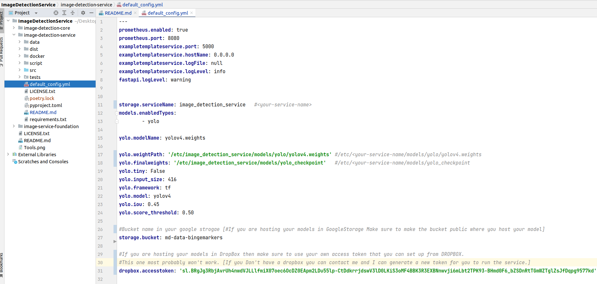

 <a href="">
        </a>

#  Image Detection Service

This project contains the Image Detection Service (see [Github](https://github.com/mediadistillery/ImageDetectionService.git)) which is extended from Example Service Template (see [Github](https://github.com/mediadistillery/ExampleTemplateService.git)).
This project mainly is an example FastApi implementation where there is a full implementation of an image detection service with a YOLO4 model taken from the theAIGuysCode (see [Github](https://github.com/theAIGuysCode/yolov4-custom-functions.git)). 

## Getting Started

### Configuration

Follow these steps to set up the configuration file:

```shell

mkdir -p /etc/<your-service-name eg. image-detection-service>/
mkdir -p /etc/<your-service-name eg. image-detection-service>/data

cp default_config.yml /etc/<your-service-name eg. image-detection-service>/config.yml
cp -R data/* /etc/<your-service-name eg. image-detection-service>/data
 
```
#### About Default Config File


#### Notes
If you want to change the name of **image-detection-service** into some other name please change the **DEFAULT_CONFIG_PATH** and all the **DEFAULT_YOLO_XXX_XXX** variables accordingly in **image_detection_service/constants.py** file.
This is for development purpose. You need to build and upload a new version of the package in order to see the changes.


Update any configuration as necessary. The template contains defaults for all variables.

#### About Model hosting
You can either keep your model in some public google bucket and access it with that or keep the model
in drop box as well.
If you are hosting your models in **GoogleStorage** Make sure to make the bucket public where you host your model
If you are hosting your models in **DropBox** then make sure to use your own access token that you can set up from DROPBOX.

If you really do not have any of the above place where you can store and access the model from you can just access the model from (This [Dropbox_link](https://www.dropbox.com/s/ga85crbwcnmjftd/yolov4.weights?dl=0))
```shell

mkdir -p /etc/<your-service-name eg. image-detection-service>/
mkdir -p /etc/<your-service-name eg. image-detection-service>/models/
mkdir -p /etc/<your-service-name eg. image-detection-service>/models/yolo
 
```

Put the downloaded model in the above created directory
### Installing

The actual service can be installed from PyPI (see [PyPI](https://pypi.org/)).

```shell

pip install image-detection-service

```

Or with poetry [Recommended]:

```shell

poetry add image-detection-service

```

> You need to have Poetry installed. It can be installed with pip. See the Poetry [docs](https://python-poetry.org/docs/) for more installations options.
### Environment Setup for development
All the needed library can be installed for **development** like this with Poetry:
You need to go to the image-detection-service folder and run: 
```shell
poetry install
```

Or using the requirements.txt:
```shell
pip install -r requirements.txt
pip install -e .
```

### Usage

To start the service run:

```bash

image-detection-service_web_start

```

Or use the alias:

```bash

run-cli

```

Service can be accessed through:

```bash

image-detection-service/script/request_image_detection.py

```

Also starts a Prometheus client server on port `8080` by default. It can be disabled with the configuration.

Swagger/OpenAPI documentation is available at http://localhost:5000/docs.


```bash

pip install image-detection-service==some-random-text

```

This will output all the available versions.

### Build

Individual packages can be build with

```bash

poetry build

```
and published to PYPI using
```bash

 twine upload -r package_name dist/*

```

Or with Poetry

```bash

poetry publish

```

### Docker

#### Note: to be updated. Might not work now.
To build a docker image for the service, run this command from the current directory:

> docker build --build-arg VERSION=$(poetry version --short) --tag image-detection-service:$(poetry version --short) --file docker/Dockerfile .

To run that docker image, run this command:

> docker run -p 5000:5000 -p 8080:8080 image-detection-service 

## Authors

* **Anustup** anustup@mediadistillery.com


## License

MIT.

## Changelog

* `0.1.0`
    * First Version of the image detection service

    


